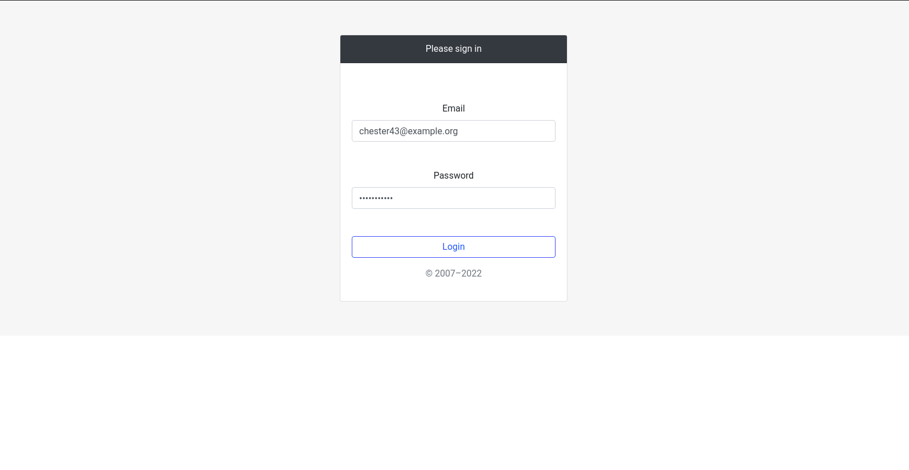
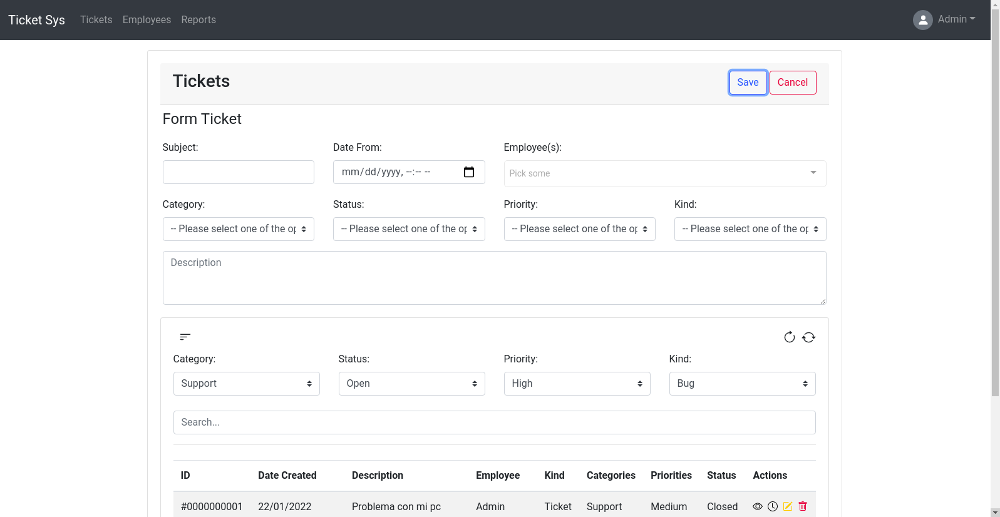
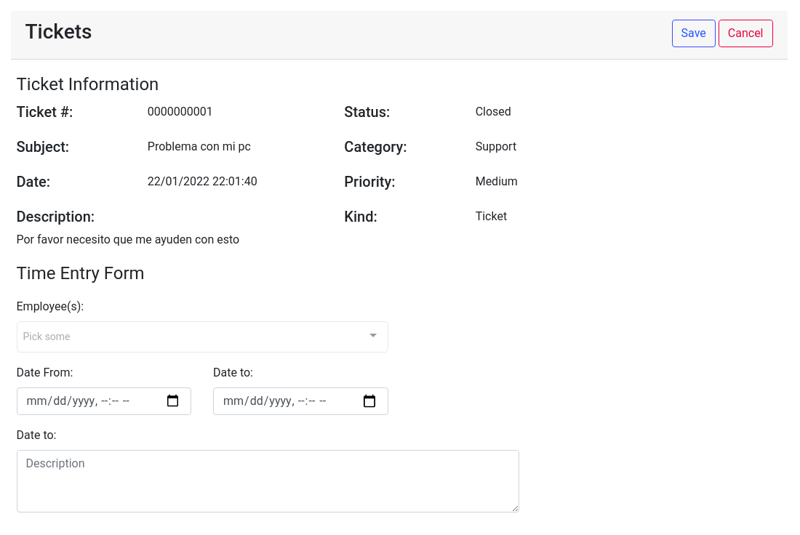
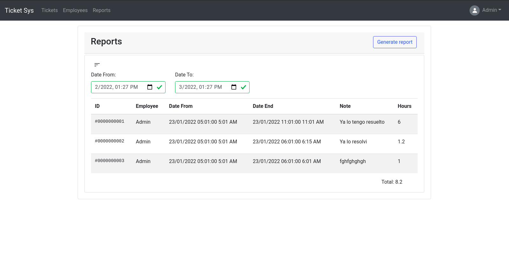

# Ticket System App 🎟

**Description:**

It is a basic system in which an employee logs in, can create, update and delete tickets, can create an employee, and then can generate a report to obtain the hours worked.

**Feature:**

- **Login:**

  
    
- **Create a ticket:**

  

- **Create employees:**

- 
    
- **Create Time entries:**

  
    

- **Reports(Worked):**

  
    
- **Technology I use:**

The ticket system uses Vue Framework, Vue JS is a progressive Javascript framework for developing user interfaces. This framework bases its main core on the view layer with the model-view-controller pattern, allowing to relate the presentation layer with the logical layer of the project in an easy and efficient way.

**Before you start:**
If you have not configured the api it is recommended that you go here [Ticket System Api](https://github.com/Darknet17/ticket-system-api "").

**Installation:**

1. **Clone the repository:**
    
    [`bash $ https://github.com/Darknet17/ticket-system-app`](https://github.com/Darknet17/ticket-system-app)
    

 2.  **Execute:** 

```
bash
$ npm install
$ npm run serve
# or run the next command for production
$ npm run build
```

 3.  **Add your file** `.env` **:**

 ` 
 bash
 $ cp env.example .env`

 4. **API entry point:**

add your entry point to connect to the api

`VUE_APP_URL_API=http://webserver/api/v1/` <br>
`VUE_APP_SANCTUM_STATEFUL_DOMAINS=http://webserver:8000/`


**Docker:**

Now let's build the Docker image of our application: 

`bash $ docker build -t ticket-system-app/dockerize-ticket-system-app .`

Now let's build the Docker image of our application:

` bash $ docker run -it -p 80:80/tcp --rm ticket-system-app/dockerize-ticket-system-app:latest`

**important**

After you have done the backend and frontend configuration, the user and password is :
`
email:admin@admin.com and password: admin1234
`
then if you want to change it, you log in and go to the employee part and change it to the one you like.
 
 
